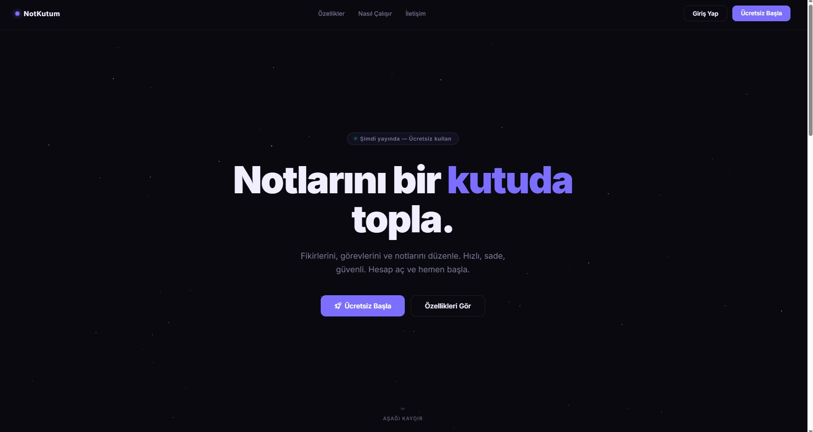
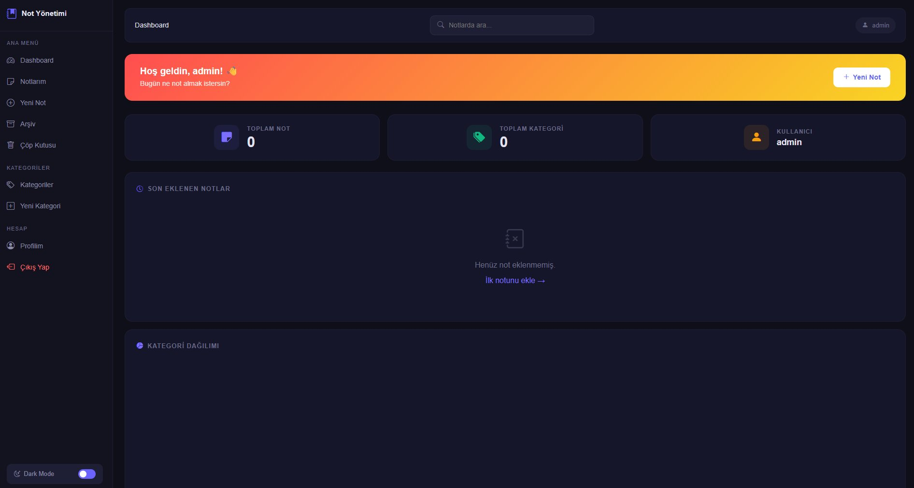
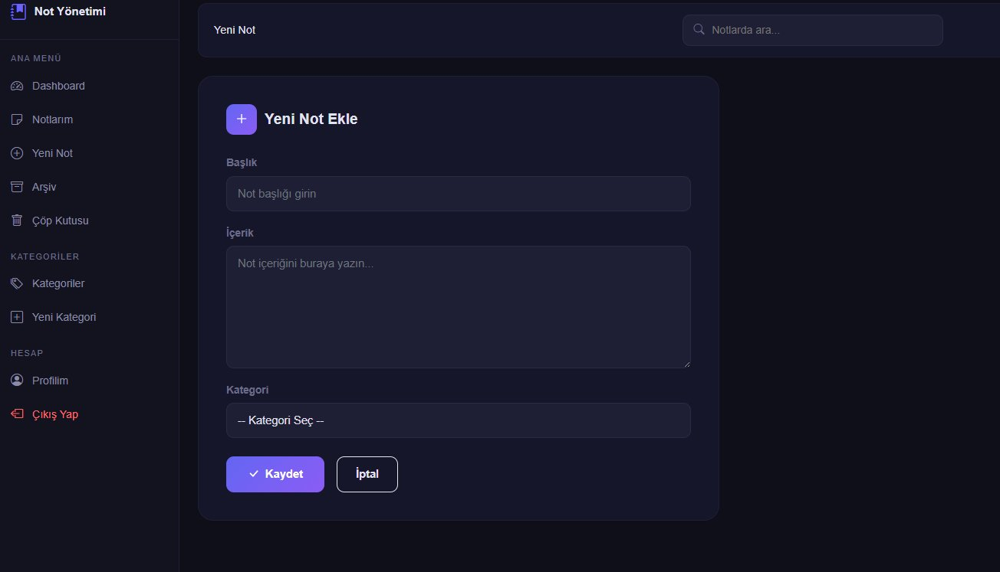
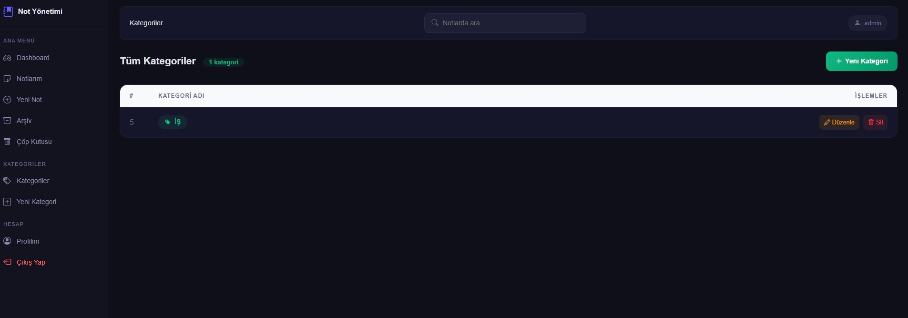
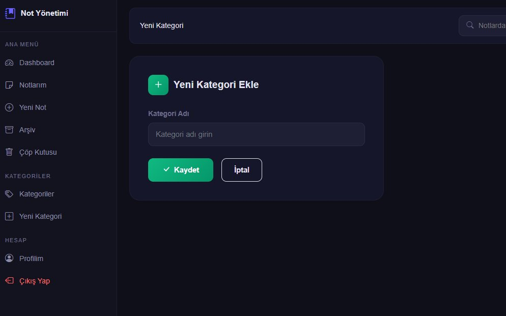

# 📒 NotKutum — Kişisel Not Yönetim Sistemi

**NotKutum**, kullanıcıların notlarını kategorilere göre organize edebildiği, arşivleyebildiği ve yönetebildiği modern bir web uygulamasıdır.

🌐 **Canlı Demo:** [notkutum.com](https://notkutum.com)



---

## 🚀 Özellikler

- 🔐 Kullanıcı kaydı ve oturum yönetimi (SHA-256 şifreleme)
- 📝 Not ekleme, düzenleme, silme (soft delete)
- 📁 Kategori bazlı not organizasyonu
- 📌 Not sabitleme
- 🗄️ Arşivleme sistemi
- 🗑️ Çöp kutusu (geri yükleme desteği)
- 🔍 Gerçek zamanlı arama
- 📊 Dashboard (kategori dağılım grafiği)
- 🛡️ Admin paneli (kullanıcı ban/unban)
- 🌙 Karanlık / Aydınlık mod
- 📱 Tam responsive tasarım

---

## 🛠️ Kullanılan Teknolojiler

| Katman | Teknoloji |
|--------|-----------|
| Backend | ASP.NET Core MVC (.NET 8) |
| ORM | Entity Framework Core (Code First) |
| Veritabanı | SQL Server (LocalDB) |
| Frontend | Bootstrap 5, Bootstrap Icons |
| Grafik | Chart.js |
| Mimari | N-Tier (4 Katman) |

---

## 🏗️ Proje Mimarisi

```
KisiselNotYonetimSistemi/
├── KisiselNotYonetimSistemi.Entity/       # Varlık sınıfları
├── KisiselNotYonetimSistemi.DataAccess/   # Veritabanı işlemleri
├── KisiselNotYonetimSistemi.Business/     # İş mantığı
└── KisiselNotYonetimSistemi/              # Web UI (MVC)
```

---

## 📸 Ekran Görüntüleri

### Dashboard


### Yeni Not Ekle


### Kategoriler


### Yeni Kategori


---

## ⚙️ Kurulum

```bash
# Repoyu klonla
git clone https://github.com/veyssel06/NotKutum.git

# appsettings.json içindeki connection string'i düzenle
# Package Manager Console'da çalıştır:
Update-Database

# Projeyi çalıştır
dotnet run
```

---

## 👤 Geliştirici

**Veysel** — [GitHub](https://github.com/veyssel06)
